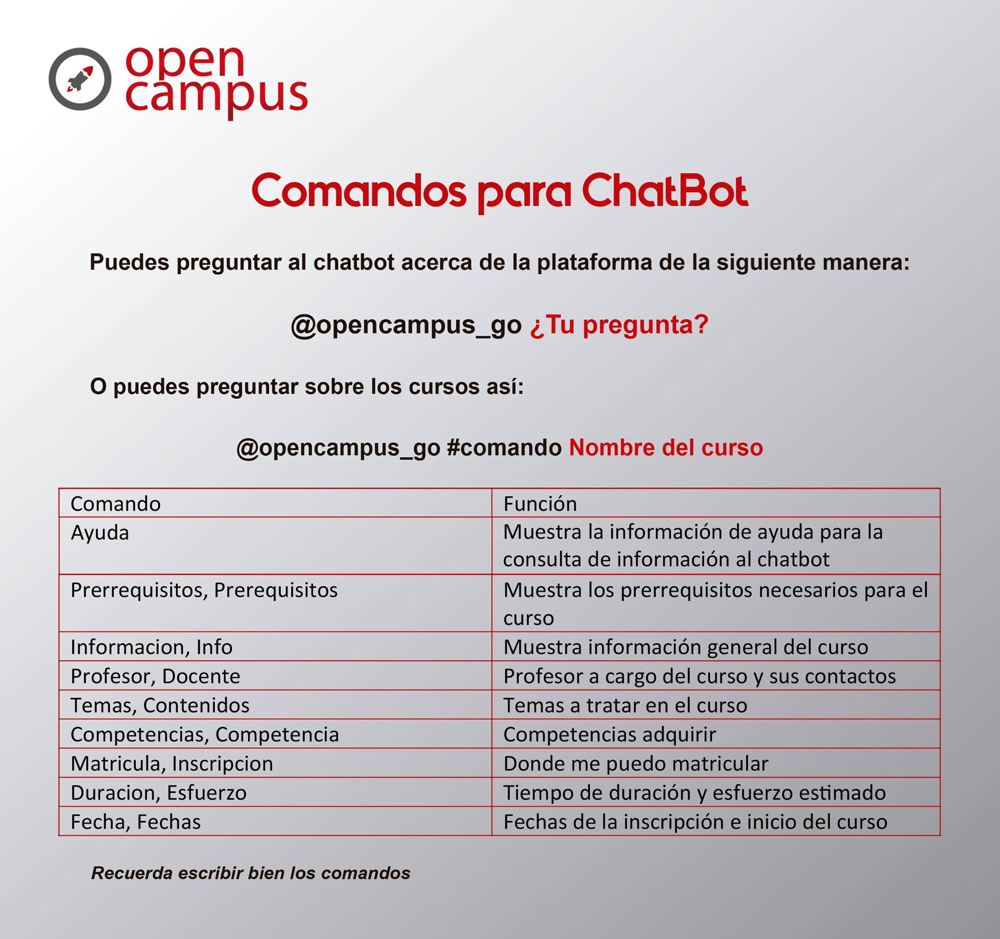

# Chat Bot a través de Twitter para Open Campus
El chat Bot que funciona a través de la plataforma de Twitter buscar capturar preguntas de Twitter acerca de la plataforma Open Campus y sus cursos.

Primero debemos crear la base de datos y poblarla, para eso usaremos el archivo **ocdb.sql**, este también será el nombre de la base de datos.

Para ejecutarlo primero debemos instalar las librerías mediante pip necesarias que se encuentran en el archivo **requeriments.txt** y configurar las variables de entorno en un archivo **.env**, este archivo deberá contar con los siguientes valores:
* DEBUG = 'False' en false
* API_KEY = '' de la cuenta de twitter
* API_SECRET = '' de la cuenta de twitter
* ACCES_TOKEN = '' de la cuenta de twitter
* ACCES_TOKEN_SECRET = '' de la cuenta de twitter
* OC_ID = '776049645327966212'  id de OpenCampus
* HOST = '' de la base de datos
* USER = '' de la base de datos
* DB_PASS = '' de la base de datos
* DN_NAME = '' de la base de datos

## Comandos soportados actualmente

